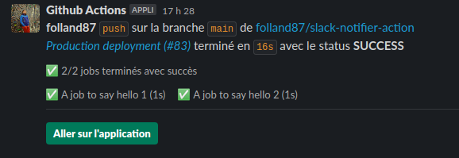

# slack-notifier-action
This actions allows to send a message in slack channels in a github actions pipeline.
It uses github workflow context to display a formatted message on a selected slack channel.

## Inputs

| Name | Required | Description |
| ---- | -------- | ----------- |
| **github_token** | _required_ | Your github token. Usually use `${{ secrets.GITHUB_TOKEN }}`.
| **slack_token** | _required_ | Your slack bot token. Set it as a secret and use it as `${{ secrets.SLACK_TOKEN }}`
| **slack_channel** | _required_ | A slack channel to publish the message.
| **report_jobs** | _optional_ | If `true`, reports the status of all jobs. **Default**: `true`
| **deployment_url** | _optional_ | If provided, adds a button that links to an app deployment. **Default**: ""
*Only printed if workflow is successfull*

## Usage
```yaml
name: Production deployment
on: [push]

jobs:
  hello_job1:
    runs-on: ubuntu-latest
    name: A job to say hello 1
    steps:
      - run: echo 'hello'
  hello_job2:
    runs-on: ubuntu-latest
    name: A job to say hello 2
    steps:
      - run: echo 'hello'
  
  hello_world_job:
    needs:
      - hello_job1
      - hello_job2
    if: always()
    runs-on: ubuntu-latest
    steps:
      - uses: actions/checkout@v2
      - uses: dataesr/slack-notifier-action@v1
        with:
          github_token: ${{ secrets.GITHUB_TOKEN}}
          slack_token: ${{ secrets.SLACK_TOKEN }}
          slack_channel: '#<slack-channel>'
          deployment_url: '<your-app-url>'
```
Slack message:
